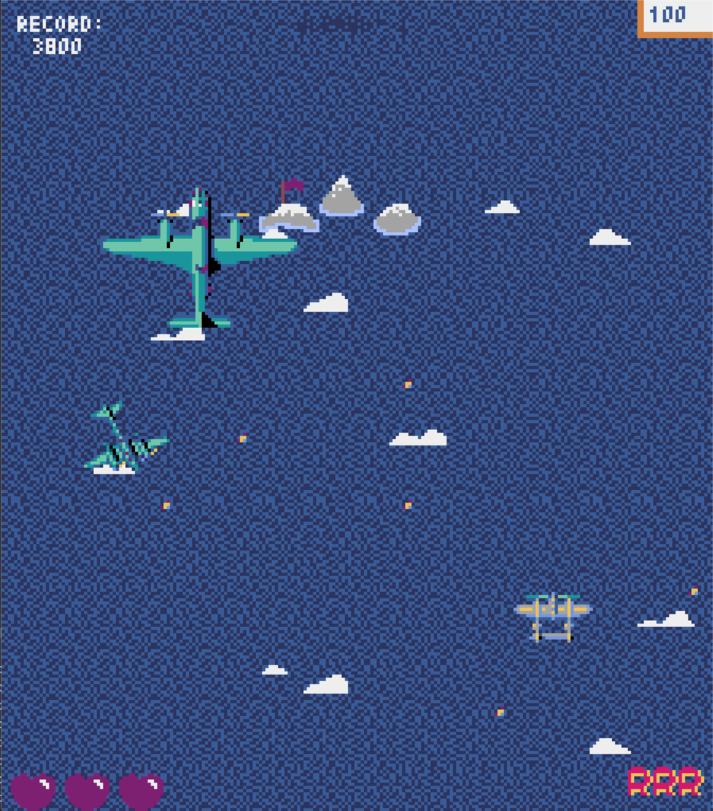

\# 1942 Arcade Shooter



A 1942-inspired arcade shoot 'em up developed in \*\*Python\*\* using the \*\*Pyxel\*\* game engine.


s
This project was originally developed in \*\*2022 as part of a university programming course\*\*. It recreates the core gameplay of classic vertical-scrolling arcade shooters, including multiple enemy types, projectile-based combat, power-ups, progressive waves and a scoring system.


\## Features


\* Object-oriented implementation of players, enemies and projectiles.

\* Multiple enemy types with different movement and attack behaviours.

\* Five progressively more difficult enemy waves.

\* Player and enemy projectile systems.

\* Collision detection between players, enemies, bullets and power-ups.

\* Dodge mechanic with limited uses.

\* Different power-ups that can:


&#x20; \* Increase the player's score.

&#x20; \* Increase movement speed.

&#x20; \* Grant an additional dodge.

&#x20; \* Grant an additional life.

\* Player lives and scoring system.

\* High-score tracking during the current execution.

\* Sprite-based animations for movement, impacts and explosions.

\* Scrolling background inspired by the original \*1942\* arcade game.


\## Controls


| Key          | Action                  |

| ------------ | ----------------------- |

| `Arrow Keys` | Move the aircraft       |

| `Space`      | Shoot                   |

| `Z`          | Perform a dodge         |

| `Q`          | Quit the game           |

| `R`          | Restart after Game Over |


\## Requirements


\* Python 3.x

\* Pyxel


Install the project dependencies using:


```bash

pip install -r requirements.txt

```


\## Running the Game


Clone the repository and navigate to its directory:


```bash

git clone https://github.com/100499164/1942-pyxel.git

cd 1942-pyxel

```


Install the required dependencies:


```bash

pip install -r requirements.txt

```


Then run:


```bash

python main.py

```


\## Project Structure


```text

.

├── Assets/

│   └── banco\_general.pyxres

├── avion.py

├── bala.py

├── balaEnemigo.py

├── balaPlayer.py

├── board.py

├── config.py

├── enemigo.py

├── enemigoBombardero.py

├── enemigoRegular.py

├── enemigoRojo.py

├── enemigoSuperbombardero.py

├── main.py

├── player.py

├── powerup.py

└── requirements.txt

```


\## About the Project


This project was originally created in \*\*2022 as part of a university programming course\*\* and is based on the gameplay of Capcom's \*1942\*.


The current repository preserves the original implementation while serving as a base for further maintenance, refactoring and improvements.


